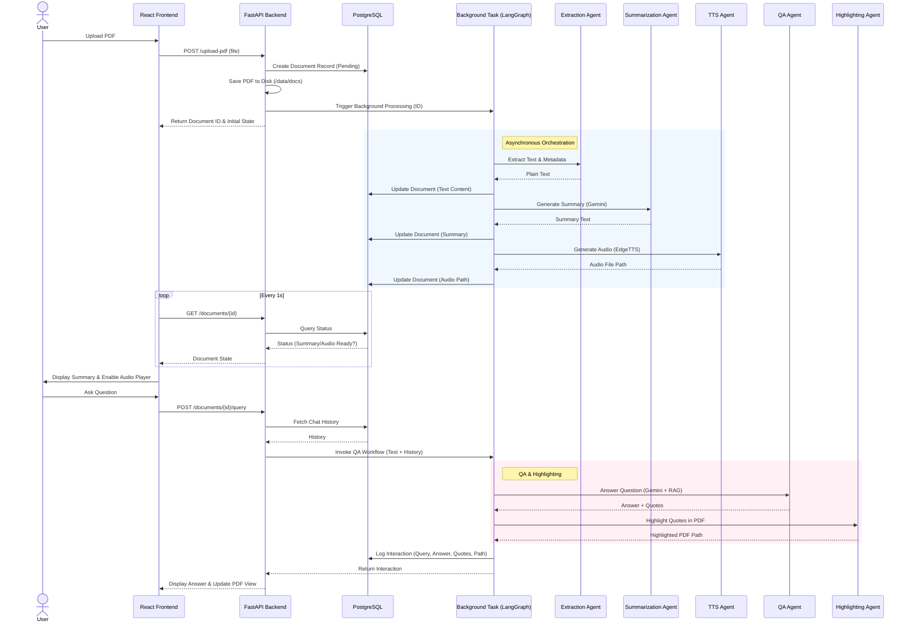

# System Architecture

## Sequence Diagram

This diagram illustrates the asynchronous flow of the Multi-Agent PDF QA System, highlighting the interaction between the User, React UI, FastAPI Backend, PostgreSQL DB, and the various LangGraph Agents.

